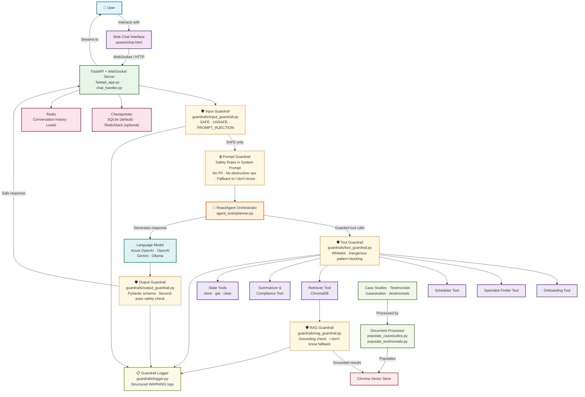
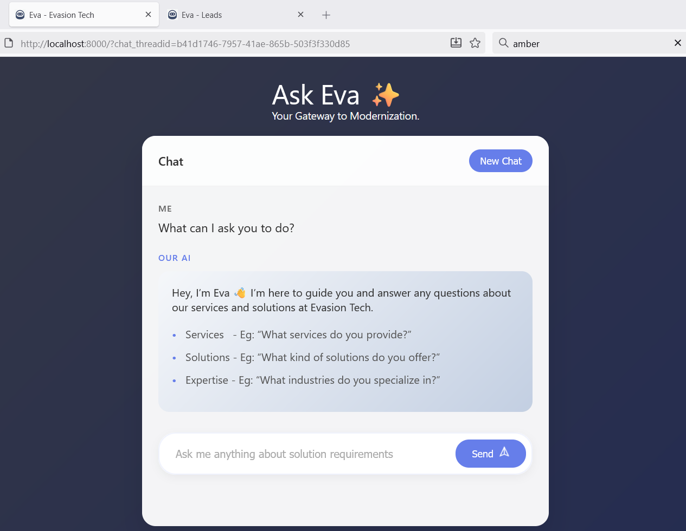
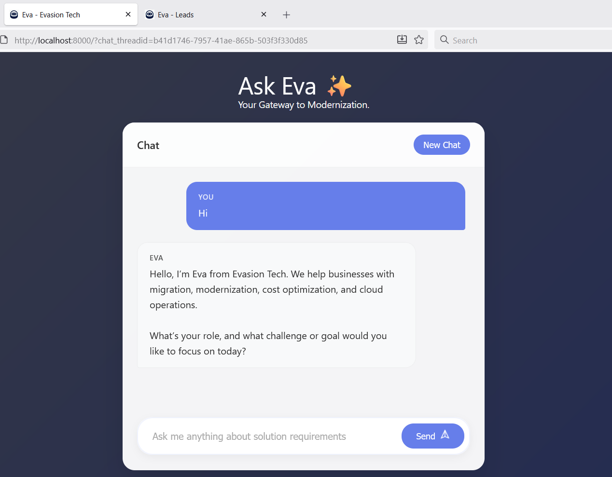
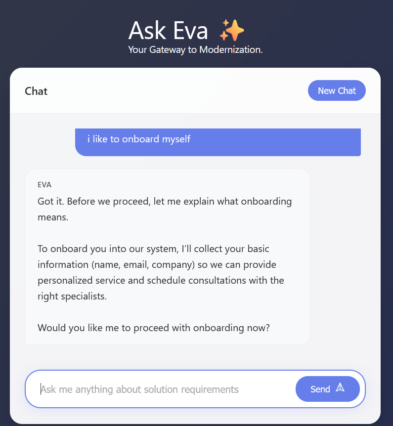
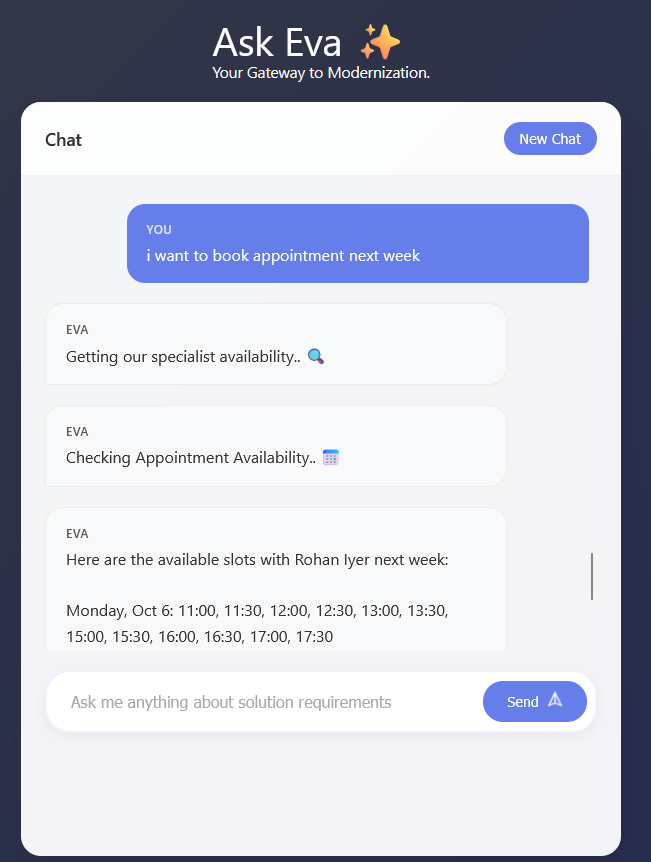
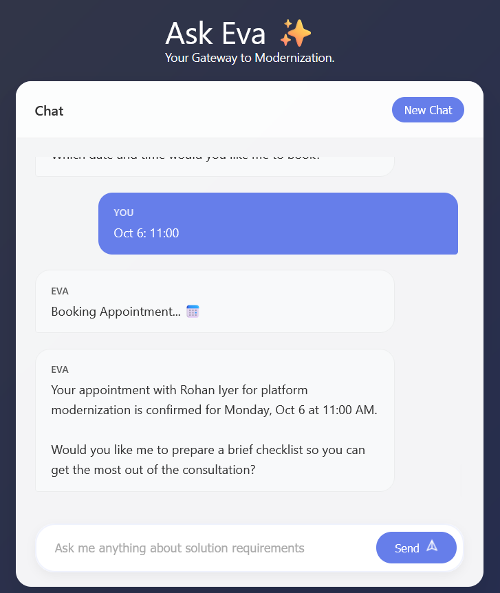
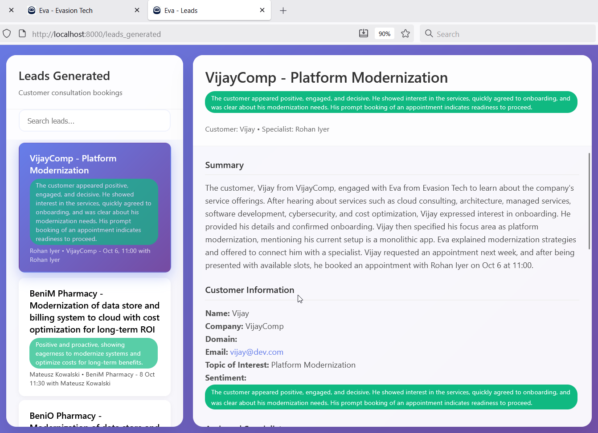

# MultiAgent Boilerplate - Orchestrate AI workflows with ReactAgent and modular tools for scalable automation.

## Summary

**MultiAgent Boilerplate is a production-ready framework** for building extensible, tool-driven AI agents. It provides a **ReactAgent Orchestrator** for managing conversational flows, tool interactions, and business logic, with **LangGraph powering the orchestration logic** as a core component. The system is built on **FastAPI for APIs and WebSocket communication, ChromaDB for semantic retrieval, and Redis for state management and checkpointing.**

With the **ReactAgent Orchestrator**, the flow is fully controlled by prompts - from tool calling and validation to enforcing consent and compliance. Adding a new tool or modifying workflows is as simple as updating prompts, making it easier than ever to extend and adapt the system to new requirements.

**The project** is structured so it can run standalone or be plugged into an existing **FastAPI application** with minimal changes, making it highly adaptable. With modular prompts, strict compliance flows, scalable architecture, and **production-grade guardrails**, it accelerates the development of reliable AI assistants for enterprise use cases.

This project demonstrates a **Customer Journey example**, and can be easily adapted to any organization. Simply update the prompts to reflect company offerings and values, enrich case studies and testimonials with your own data, and you’ll have a **live chatbot ready to interact with customers** and even book appointments by integrating scheduling tools with your calendar.

---

## Features

- **AI Agent Orchestration:** Modular agents automate onboarding, expert matching, appointment scheduling, and customer engagement.
- **Tool Integration:** Agents interact with tools for onboarding, specialist search, appointment booking, case studies, testimonials, and conversation summarization.
- **Extensible Prompts:** System prompts enforce business rules, consent protocols, and summarization logic.
- **Strict Protocol Enforcement:** Implements mandatory consent, ID management, and summarization protocols for compliance and reliability.
- **Semantic Search:** ChromaDB powers semantic retrieval of case studies and testimonials.
- **State Management:** Redis-backed state and checkpointing for robust session handling.
- **Persistent Checkpointing:** Conversation state survives restarts via SQLite (or RedisStack when available).
- **WebSocket Real-Time Communication:** FastAPI WebSocket endpoints for live chat and event streaming.
- **Production-Grade Logging:** Centralized, structured logging for traceability.
- **Multi-Provider LLM Support:** Azure OpenAI, OpenAI, Google Gemini, and Ollama — auto-selected from environment variables.
- **Production Guardrails:** Five-layer safety pipeline protecting every stage of the conversation.

---

## Architecture



### Component Reference

| Component | File(s) | Role |
|---|---|---|
| FastAPI + WebSocket | `fastapi_app.py`, `chat_handler.py` | REST and WebSocket endpoints, request routing |
| ReactAgent Orchestrator | `agent_tools/planner.py` | LangGraph agent loop, tool dispatch |
| Input Guardrail | `guardrails/input_guardrail.py` | LLM-based classifier — blocks UNSAFE / PROMPT_INJECTION |
| Prompt Guardrail | `prompts/planner_prompts.py` | System prompt safety rules — no PII, no destructive ops |
| Tool Guardrail | `guardrails/tool_guardrail.py` | Tool whitelist + dangerous pattern detection |
| RAG Guardrail | `guardrails/rag_guardrail.py` | Grounding check — returns "I don’t know" if no relevant docs |
| Output Guardrail | `guardrails/output_guardrail.py` | Pydantic schema validation + second-pass LLM safety check |
| Guardrail Logger | `guardrails/logger.py` | Structured `GUARDRAIL_VIOLATION` warning logs |
| ChromaDB | `chromastore/` | Semantic vector search for case studies and testimonials |
| Checkpointer | `fastapi_app.py` | SQLite (default) or RedisStack — conversation state survives restarts |
| Redis | `utils.py`, `conversations/` | Conversation history and leads storage |
| LLM Utils | `llm_utils.py` | Cached LLM factory — Azure OpenAI → OpenAI → Gemini → Ollama |

---

## Guardrails

This project implements a **five-layer guardrail pipeline** that protects every stage of the agent conversation.

```
User Input
    │
    ▼
┌─────────────────────────────────────────────┐
│  1. INPUT GUARDRAIL                         │
│     Classifies input as SAFE / UNSAFE /     │
│     PROMPT_INJECTION using an LLM call.     │
│     Blocks and logs anything non-SAFE.      │
└────────────────────┬────────────────────────┘
                     │ SAFE only
                     ▼
┌─────────────────────────────────────────────┐
│  2. PROMPT GUARDRAIL                        │
│     Safety Rules enforced in the system     │
│     prompt: no PII exposure, no destructive │
│     ops, respond "I don’t know" if unsure.  │
└────────────────────┬────────────────────────┘
                     │
                     ▼
┌─────────────────────────────────────────────┐
│  3. TOOL GUARDRAIL                          │
│     Every tool call validated against a     │
│     10-tool whitelist. Inputs scanned for   │
│     dangerous patterns (SQL drops, shell    │
│     commands, path traversal, injections).  │
└────────────────────┬────────────────────────┘
                     │
                     ▼
┌─────────────────────────────────────────────┐
│  4. RAG GUARDRAIL                           │
│     Chroma retrieval results checked for    │
│     relevance (cosine distance threshold).  │
│     Returns "I don’t know" if no grounded   │
│     context is found — prevents hallucation.│
└────────────────────┬────────────────────────┘
                     │
                     ▼
┌─────────────────────────────────────────────┐
│  5. OUTPUT GUARDRAIL                        │
│     Pydantic schema validates response      │
│     structure and length. A second-pass LLM │
│     safety check scans for PII, credentials │
│     and harmful content. Unsafe responses   │
│     are replaced with a safe fallback.      │
└────────────────────┬────────────────────────┘
                     │
                     ▼
              Safe Response → User

All violations logged as:
GUARDRAIL_VIOLATION | layer=X | thread=Y | reason=Z
```

### Guardrail Files

```
guardrails/
├── __init__.py            # Package exports
├── input_guardrail.py     # Input classification (SAFE / UNSAFE / PROMPT_INJECTION)
├── output_guardrail.py    # Pydantic output schema + second-pass LLM safety check
├── tool_guardrail.py      # Tool whitelist + dangerous pattern blocking
├── rag_guardrail.py       # RAG grounding check (relevance threshold)
├── logger.py              # Structured GUARDRAIL_VIOLATION log helper
└── utils.py               # Shared JSON parsing utility
```

---

## Project Structure

```
.
├── agent_tools/            # AI agent tools (customers, specialists, appointments, etc.)
├── conversations/          # Conversation state and thread management
├── guardrails/             # Five-layer safety pipeline
│   ├── input_guardrail.py  # Input classification
│   ├── output_guardrail.py # Output validation
│   ├── tool_guardrail.py   # Tool whitelist + pattern blocking
│   ├── rag_guardrail.py    # RAG grounding check
│   ├── logger.py           # Violation logger
│   └── utils.py            # Shared JSON parsing
├── websocket/              # WebSocket manager and handlers
├── prompts/                # System and planner prompts
├── data/                   # CSVs and persistent data (appointments, specialists, etc.)
├── chromastore/            # ChromaDB vector stores for semantic search
├── assets/                 # Static files for chat UI
├── fastapi_app.py          # FastAPI application entrypoint
├── llm_utils.py            # LLM and embedding utilities (cached, multi-provider)
├── utils.py                # Utility functions and environment management
├── config.py               # Company and chatbot configuration
├── populate_casestudies.py # Script to populate ChromaDB with case studies
├── populate_testimonials.py # Script to populate ChromaDB with testimonials
└── README.md               # Project documentation
```

---

## Setup

1. **Install dependencies:**
   ```bash
   pip install -r requirements.txt
   ```

2. **Configure environment:**
   Copy `.env.sample` to `.env` and fill in your credentials:

   ```env
   # LLM Provider — first match wins (Azure → OpenAI → Google → Ollama)
   AZURE_OPENAI_API_KEY=
   AZURE_OPENAI_ENDPOINT=
   AZURE_OPENAI_DEPLOYMENT_NAME=
   AZURE_OPENAI_API_VERSION=2024-02-01

   OPENAI_API_KEY=
   GOOGLE_API_KEY=

   # Redis (optional — for conversation history and leads)
   REDIS_HOST=localhost
   REDIS_PORT=6379

   # Persistent checkpointing (SQLite by default)
   CHECKPOINT_DB_PATH=checkpoints.db
   ```

   Modify `config.py` for company-specific settings (`COMPANY_NAME`, `CHATBOT_NAME`, etc.).

3. **Populate vector databases:**
   Place JSON/txt files in `casestudies/` and `testimonials/`, then run:
   ```bash
   python populate_casestudies.py
   python populate_testimonials.py
   ```

---

## Running the Application

1. **Start the FastAPI server:**
   ```bash
   python fastapi_app.py
   ```

2. **Access the chat interface:**
   - Open your browser to `http://localhost:8000`
   - A new thread is created automatically: `http://localhost:8000/?chat_threadid=<uuid>`
   - This thread ID manages conversation state — conversations **resume after restart** via the SQLite checkpointer.
   - Full message history is stored in Redis: hash `conversation:user`, key = `threadID`.
   - Open multiple tabs to simulate different users or sessions.
   - After appointment booking, a conversation summary is stored in Redis under `leads_generated` (view at `http://localhost:8000/leads_generated`).

---

## Checkpointing & Conversation Persistence

Conversation state is persisted using a three-tier checkpointer strategy:

| Priority | Checkpointer | When used |
|---|---|---|
| 1 | **AsyncRedisSaver** | `REDIS_HOST` set and RedisStack module available |
| 2 | **AsyncSqliteSaver** | Default fallback — persists to `checkpoints.db` |
| 3 | **MemorySaver** | Never used (removed as fallback) |

The SQLite checkpointer ensures conversations survive application restarts without requiring any additional infrastructure.

---

## Screenshots

> Chat Interface<BR>
    

> Sample Flow Onboarding & Appointment Booking<BR>
    

> Leads Dashboard


---

## Future Customization

- **Add new tools:** Implement in `agent_tools/` and register with the planner in `agent_tools/planner.py`. Add the tool name to `ALLOWED_TOOLS` in `guardrails/tool_guardrail.py`.
- **Update prompts and business logic:** Edit `prompts/planner_prompts.py`.
- **Tune guardrail thresholds:** Adjust `_RELEVANCE_THRESHOLD` in `guardrails/rag_guardrail.py` or extend `_DANGEROUS_PATTERNS` in `guardrails/tool_guardrail.py`.
- **Integrate new data sources:** Update population scripts and vector database logic.
- **Extend agent capabilities:** Add new flows, protocols, or integrations as needed.

---

## Contributing

Contributions are welcome! Please open issues or submit pull requests for bug fixes, enhancements, or new features. For major changes, discuss proposals in advance.

---

## License

This project is intended for educational and production use and can be adapted for commercial deployments. Please review and comply with all third-party licenses.

